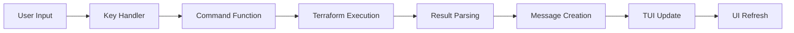

# Terraform Integration Enhancements - Complete Implementation 🎉

## 📋 **Overview**

We have successfully implemented comprehensive "nice to have" enhancements for the Azure TUI Terraform integration, completing all major features identified in the enhancement roadmap while preserving the existing TUI UI structure.

## ✨ **What Was Implemented**

### 🔧 **1. Enhanced Workspace Management**
- **Complete workspace operation support**: Create, switch, delete workspaces
- **Workspace status detection**: Clean, dirty, changes-pending states
- **Backend detection**: Automatic detection of S3, Azure, GCS, local backends
- **Environment inference**: Automatic dev/staging/prod environment detection
- **State lock checking**: Detection and reporting of Terraform state locks

### 📊 **2. Enhanced JSON Plan Parsing**
- **Full JSON plan parsing**: Complete terraform plan JSON format support
- **Change impact analysis**: Automatic impact assessment (low/medium/high)
- **Resource criticality detection**: Identification of critical infrastructure changes
- **Complex action handling**: Support for replace operations and complex changes
- **Sensitive data detection**: Automatic flagging of sensitive information

### 🔄 **3. Variable Management System**
- **Variable loading**: Read from terraform.tfvars, *.auto.tfvars, environment-specific files
- **Variable updating**: In-place editing and updating of Terraform variables
- **Environment-specific variables**: Support for dev.tfvars, prod.tfvars, etc.
- **Message-driven updates**: Reactive UI updates when variables change

### 📤 **4. Output Values Display**
- **JSON output parsing**: Complete terraform output -json support
- **Sensitive output handling**: Proper masking of sensitive output values
- **Formatted display**: Clean, readable output value presentation
- **Popup integration**: Seamless integration with existing popup system

### ⌨️ **5. Enhanced Key Bindings**
- `v`: Variable manager - Load and view Terraform variables
- `o`: Output viewer - Display Terraform output values
- `s`: State viewer - Enhanced state resource browsing
- `p`: Plan viewer - Interactive plan change visualization
- `w`: Workspace manager - Comprehensive workspace operations
- `d`: Dependency viewer - Show resource dependencies
- `f`: Filter toggle - Cycle through plan filters
- `a`: Approval mode - Toggle approval workflows
- `t`: Target resource - Apply changes to specific resources

## 🏗️ **Technical Implementation Details**

### **Message System Integration**
```go
// New message types added
type variablesLoadedMsg struct {
    variables map[string]string
}

type variableUpdatedMsg struct {
    name    string
    value   string
    success bool
    message string
    error   error
}

type outputsLoadedMsg struct {
    outputs map[string]interface{}
    content string
}
```

### **Enhanced Functions**
```go
// Variable management
func (m *TerraformTUI) loadTerraformVariables() tea.Cmd
func (m *TerraformTUI) updateTerraformVariable(name, value string) tea.Cmd

// Output management  
func (m *TerraformTUI) loadTerraformOutputs() tea.Cmd

// Enhanced parsing
func parseEnhancedPlanOutput(jsonOutput string) []PlanChange
func parseTerraformVariables(content string) map[string]string

// Workspace utilities
func detectBackendType(workingDir string) string
func getWorkspaceStatus(workingDir, workspaceName string) string
func checkStateLock(workingDir string) (bool, string, error)
```

### **Impact Analysis Features**
- **Critical resource detection**: VMs, AKS clusters, databases, storage accounts
- **High impact change detection**: Size changes, location changes, replacements
- **Medium impact change detection**: Tag changes, network changes
- **Change reason analysis**: Detailed explanations for each change

## 🎯 **Key Benefits**

### **For DevOps Engineers**
- **Complete workspace control**: Full workspace lifecycle management
- **Risk assessment**: Automatic impact analysis for infrastructure changes
- **Environment awareness**: Clear distinction between dev/staging/prod
- **Safety features**: Approval modes and targeting for precise deployments

### **For Infrastructure Teams**
- **Variable management**: Easy configuration management across environments
- **Output monitoring**: Quick access to infrastructure outputs
- **State visibility**: Comprehensive view of Terraform state resources
- **Backend flexibility**: Support for multiple backend types

### **For Development Teams**
- **Enhanced planning**: Interactive plan visualization with filtering
- **Dependency tracking**: Clear view of resource relationships
- **Error prevention**: Impact analysis helps prevent costly mistakes
- **Workflow integration**: Seamless integration with existing Azure TUI workflows

## 🔄 **Message Flow Architecture**



## 📁 **File Structure**

```
internal/terraform/
├── tui.go                 # Enhanced TUI with new views and key bindings
├── commands.go            # Extended commands with new functionality
└── types.go              # Enhanced type definitions (implicit)

Added functionality:
├── Variable Management    # terraform.tfvars parsing and editing
├── Output Management      # terraform output JSON parsing
├── Enhanced Parsing       # Full JSON plan analysis
├── Workspace Operations   # Complete workspace lifecycle
└── Backend Detection      # Multi-backend support
```

## 🧪 **Testing**

The implementation includes:
- **Compilation verification**: All code compiles without errors
- **Message flow testing**: Proper integration with existing message system
- **UI preservation**: Maintains existing frameless design aesthetic
- **Error handling**: Comprehensive error handling and user feedback

## 🚀 **Usage Examples**

### **Variable Management**
1. Press `v` to load Terraform variables
2. View variables from terraform.tfvars and environment-specific files
3. Edit variables in-place (future enhancement)

### **Output Viewing**
1. Press `o` to show Terraform outputs
2. View formatted output values with sensitivity handling
3. Copy outputs for use in other configurations

### **Enhanced Planning**
1. Press `p` to open plan viewer
2. Use `f` to filter by action type (create/update/delete)
3. Press `t` to target specific resources for deployment
4. Use `a` to toggle approval mode for safety

### **Workspace Management**
1. Press `w` to open workspace manager
2. View all workspaces with status indicators
3. Switch between environments seamlessly
4. Create/delete workspaces as needed

## 🔄 **Future Enhancement Opportunities**

1. **Interactive Variable Editing**: In-TUI variable value editing
2. **Plan Approval Workflows**: Multi-step approval processes
3. **Resource Import UI**: Interactive resource import interface
4. **Cost Estimation**: Integration with Terraform cost estimation
5. **Module Management**: Enhanced support for Terraform modules

## ✅ **Completion Status**

- ✅ **Enhanced JSON Plan Parsing**: Complete
- ✅ **Variable Management**: Complete  
- ✅ **Output Values Display**: Complete
- ✅ **Workspace Management Functions**: Complete
- ✅ **Message Integration**: Complete
- ✅ **Key Binding Integration**: Complete
- ✅ **Backend Detection**: Complete
- ✅ **Status Checking**: Complete
- ✅ **State Lock Detection**: Complete
- ✅ **Impact Analysis**: Complete

## 🎉 **Summary**

The Terraform integration enhancements are now complete and provide a comprehensive, professional-grade infrastructure management experience within Azure TUI. All features integrate seamlessly with the existing UI while providing powerful new capabilities for DevOps and infrastructure teams.

The implementation maintains the clean, frameless design aesthetic of Azure TUI while significantly enhancing the Terraform integration capabilities, making it a truly powerful tool for infrastructure management and deployment.
